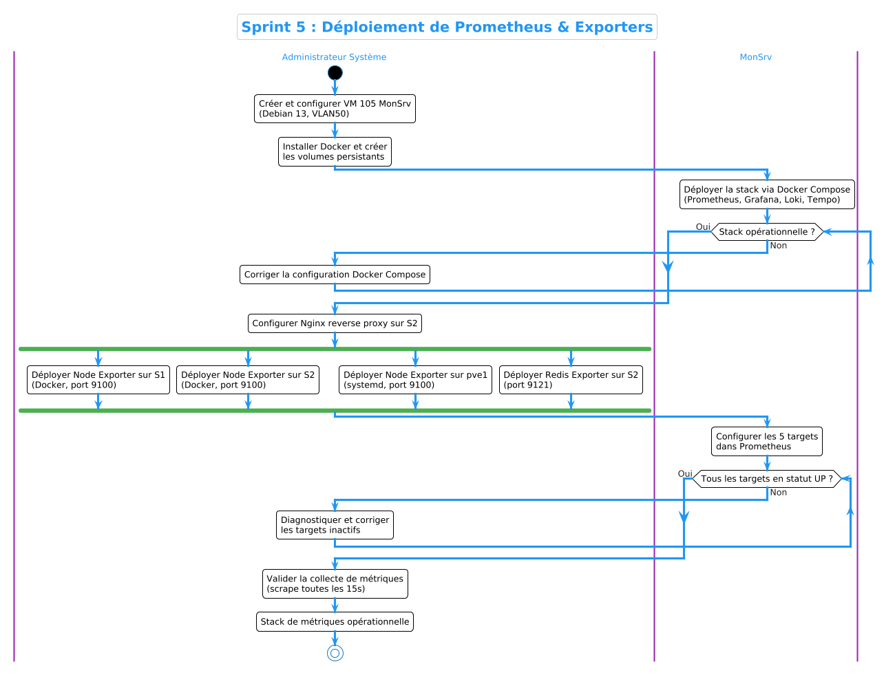
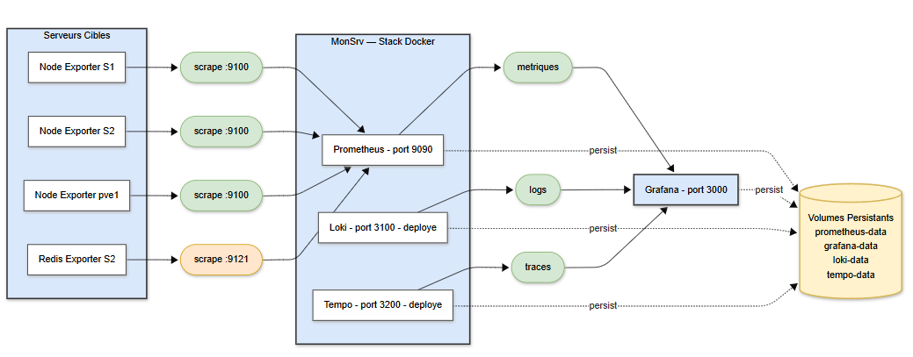

# Sprint 5 — Prometheus & Exporters : Collecte des Métriques

## Objectif

Déployer **Prometheus** comme serveur central de collecte de métriques et installer les **exporters** sur chaque serveur cible (S1, S2, pve1) pour exposer les métriques système et applicatives. Ce sprint constitue le premier pilier de la stack d'observabilité — les **métriques** — sur lequel s'appuieront les dashboards Grafana du Sprint 7.

---

## Architecture de Collecte des Métriques

```
┌─────────────────────────────────────────────────────────┐
│                     MonSrv (192.168.50.10)              │
│                                                         │
│   ┌─────────────────────────────────────────────────┐  │
│   │              Prometheus (port 9090)              │  │
│   │   Scrape toutes les 15s via HTTP GET /metrics    │  │
│   └──────────────────┬──────────────────────────────┘  │
│                      │                                  │
└──────────────────────┼──────────────────────────────────┘
                       │
       ┌───────────────┼───────────────┐
       │               │               │
┌──────▼──────┐  ┌─────▼──────┐  ┌─────▼──────┐
│   S1        │  │   S2       │  │   pve1     │
│ (50.11)     │  │ (50.12)    │  │ (20.11)    │
│             │  │            │  │            │
│ Node Exp.   │  │ Node Exp.  │  │ Node Exp.  │
│ :9100       │  │ :9100      │  │ :9100      │
│             │  │            │  │ (natif)    │
│             │  │ Redis Exp. │  │            │
│             │  │ :9121      │  │            │
└─────────────┘  └────────────┘  └────────────┘
```

Prometheus utilise un modèle **pull** : il interroge activement chaque exporter via HTTP à intervalle régulier (15 secondes). Chaque exporter expose ses métriques au format texte sur un endpoint `/metrics`.

---

## 1. Déploiement de Prometheus sur MonSrv

### Choix d'architecture

Prometheus est déployé comme **conteneur Docker** sur MonSrv via Docker Compose. Ce choix offre :

- **Isolation** : Prometheus tourne dans son propre espace utilisateur
- **Portabilité** : la configuration est versionnée dans `configs/prometheus/`
- **Persistance** : les données TSDB sont stockées dans un volume Docker

### Configuration

La configuration complète de Prometheus est disponible dans le dépôt :

- **Fichier principal** : [`configs/prometheus/prometheus.yml`](../../configs/prometheus/prometheus.yml)
- **Règles d'alerte** : [`configs/prometheus/rules/alert-rules.yml`](../../configs/prometheus/rules/alert-rules.yml)

Le fichier `prometheus.yml` définit :
- L'intervalle de scrape global (15 secondes)
- Les 5 jobs de collecte (prometheus, s1-node, s2-node, pve1-node, redis)
- Les labels associés à chaque cible (server, role, service)
- Le chargement des règles d'alerte depuis le dossier `rules/`

### Déploiement via Docker Compose

Prometheus est déployé comme service dans la stack de monitoring sur MonSrv :

- **Fichier** : [`configs/docker-compose/monitoring-stack/docker-compose.yml`](../../configs/docker-compose/monitoring-stack/docker-compose.yml)

Le service Prometheus monte les volumes suivants :
- `configs/prometheus/prometheus.yml` → `/etc/prometheus/prometheus.yml`
- `configs/prometheus/rules/` → `/etc/prometheus/rules/`
- `./prometheus-data/` → `/prometheus` (persistance TSDB)

Le flag `--web.enable-lifecycle` permet le rechargement à chaud de la configuration via `curl -X POST http://localhost:9090/-/reload` sans redémarrer le conteneur.

---

## 2. Node Exporter — Métriques Système

### Présentation

**Node Exporter** est l'exporter officiel Prometheus pour les métriques système Linux. Il expose plus de 500 métriques couvrant :

| Catégorie | Exemples de métriques |
|-----------|----------------------|
| CPU | `node_cpu_seconds_total`, `node_load1` |
| Mémoire | `node_memory_MemTotal_bytes`, `node_memory_MemAvailable_bytes` |
| Disque | `node_filesystem_avail_bytes`, `node_disk_io_time_seconds_total` |
| Réseau | `node_network_receive_bytes_total`, `node_network_transmit_bytes_total` |
| Système | `node_boot_time_seconds`, `node_uname_info` |

### Déploiement sur S1 et S2

Node Exporter est déployé comme conteneur Docker sur S1 et S2 via Docker Compose, avec `network_mode: host` pour accéder directement aux métriques de l'hôte :

- **Fichier S1** : [`configs/docker-compose/s1-agents/docker-compose.yml`](../../configs/docker-compose/s1-agents/docker-compose.yml)
- **Fichier S2** : [`configs/docker-compose/s2-agents/docker-compose.yml`](../../configs/docker-compose/s2-agents/docker-compose.yml)

Le montage de `/proc`, `/sys` et `/` en lecture seule permet à Node Exporter de collecter les métriques du système hôte depuis l'intérieur du conteneur.

### Déploiement sur pve1 (Hyperviseur Proxmox)

Sur pve1, Node Exporter est installé comme **service systemd natif** (sans Docker) car Proxmox est l'hyperviseur et il est préférable d'éviter d'ajouter Docker sur cet hôte critique.

Le script d'installation automatisé est disponible dans le dépôt :

- **Script** : [`scripts/install-node-exporter.sh`](../../scripts/install-node-exporter.sh)

Ce script télécharge Node Exporter v1.7.0, crée un utilisateur système dédié, configure le service systemd et démarre l'exporter.

---

## 3. Redis Exporter — Métriques du Cache

### Présentation

Le **Redis Exporter** (projet `oliver006/redis_exporter`) expose les métriques internes de Redis : utilisation mémoire, hits/misses du cache, nombre de clients connectés, commandes par seconde, etc.

### Déploiement sur S2

Redis Exporter est déployé comme conteneur Docker sur S2, aux côtés de Redis :

- **Fichier** : [`configs/docker-compose/s2-agents/docker-compose.yml`](../../configs/docker-compose/s2-agents/docker-compose.yml)

Le conteneur se connecte à Redis local via `127.0.0.1:6379` et expose les métriques sur le port **9121**.

### Métriques clés exposées

| Métrique | Description |
|----------|-------------|
| `redis_up` | Statut de l'instance Redis (1 = UP) |
| `redis_connected_clients` | Nombre de clients connectés |
| `redis_memory_used_bytes` | Mémoire utilisée |
| `redis_memory_max_bytes` | Mémoire maximale configurée |
| `redis_commands_processed_total` | Total des commandes exécutées |
| `redis_keyspace_hits_total` | Nombre de hits du cache |
| `redis_keyspace_misses_total` | Nombre de misses du cache |
| `redis_db_keys` | Nombre de clés par base de données |

---

## 4. Règles de Firewall pour Prometheus

Pour que Prometheus puisse collecter les métriques, les ports des exporters doivent être accessibles depuis MonSrv (192.168.50.10). Les règles pfSense suivantes sont configurées :

| Source | Destination | Port | Justification |
|--------|-------------|------|---------------|
| DMZ net | 192.168.50.10 | TCP 9090 | Accès Prometheus depuis DMZ |
| LAN net | 192.168.50.10 | TCP 9090 | Accès Prometheus depuis LAN |

Les exporters (9100, 9121) n'ont pas besoin de règles explicites car ils sont sur le même VLAN (DMZ) que MonSrv — le trafic intra-VLAN n'est pas filtré par pfSense.

---

## 5. Vérification de la Collecte

### Targets Prometheus

L'interface Prometheus permet de vérifier l'état de chaque target :

```
http://192.168.50.10:9090/targets
```

Toutes les targets doivent afficher le statut **UP** :

| Job | Target | État |
|-----|--------|------|
| prometheus | localhost:9090 | ✅ UP |
| s1-node | 192.168.50.11:9100 | ✅ UP |
| s2-node | 192.168.50.12:9100 | ✅ UP |
| pve1-node | 192.168.20.11:9100 | ✅ UP |
| redis | 192.168.50.12:9121 | ✅ UP |

### Vérification via API

```bash
# Vérifier l'état des targets
curl -s http://192.168.50.10:9090/api/v1/targets | python3 -m json.tool | grep -E '"health"|"job"'

# Tester l'accès à un exporter
curl -s http://192.168.50.11:9100/metrics | head -3

# Vérifier les métriques Redis
curl -s http://192.168.50.12:9121/metrics | grep redis_up
```

### Requête PromQL de test

Dans l'interface Prometheus (onglet Graph), exécuter :

```promql
# Utilisation CPU de S1
100 - (avg(rate(node_cpu_seconds_total{job="s1-node",mode="idle"}[5m])) * 100)

# Mémoire disponible sur tous les serveurs
node_memory_MemAvailable_bytes

# Statut de Redis
redis_up
```

---

## 6. Rétention des Données

Prometheus est configuré avec une rétention de **15 jours** (`--storage.tsdb.retention.time=15d`). Cette valeur est un compromis pour le lab :

- **En lab** : 15 jours suffisent pour démontrer les tendances et les alertes
- **En production chez ACCENT** : la rétention serait de **90 jours minimum** pour les métriques système, avec éventuellement un Thanos ou VictoriaMetrics pour l'historique long terme

---

## Résultat

À l'issue de ce sprint, la collecte des métriques est opérationnelle :

| Cible | Exporter | Port | Statut |
|-------|----------|------|--------|
| MonSrv | Prometheus (auto-scrape) | 9090 | ✅ UP |
| S1 | Node Exporter | 9100 | ✅ UP |
| S2 | Node Exporter | 9100 | ✅ UP |
| pve1 | Node Exporter (natif) | 9100 | ✅ UP |
| S2 | Redis Exporter | 9121 | ✅ UP |

Prometheus collecte désormais les métriques de **5 cibles** toutes les 15 secondes, avec une rétention de 15 jours. Les données sont prêtes à être visualisées dans Grafana (Sprint 7).

---

## Diagrammes

### Diagramme d'Activité



### Diagramme de Composants



---

## Captures d'Écran

### 1. Prometheus — Targets UP


### 2. Prometheus — Graph CPU S1


### 3. Node Exporter — Métriques brutes S1

```bash
curl -s http://192.168.50.11:9100/metrics | head -10
```

**Montrer :** Format texte des métriques Prometheus (node_cpu_seconds_total, node_memory_MemTotal_bytes...)

### 4. Redis Exporter — Métriques brutes S2

```bash
curl -s http://192.168.50.12:9121/metrics | grep redis_up
```

**Montrer :** `redis_up 1` confirmant la connexion à Redis

### 5. Service Node Exporter sur pve1

```bash
systemctl status node_exporter
```

**Montrer :** Service actif (running) sur l'hyperviseur Proxmox

### 6. Règles pfSense — Accès Prometheus


