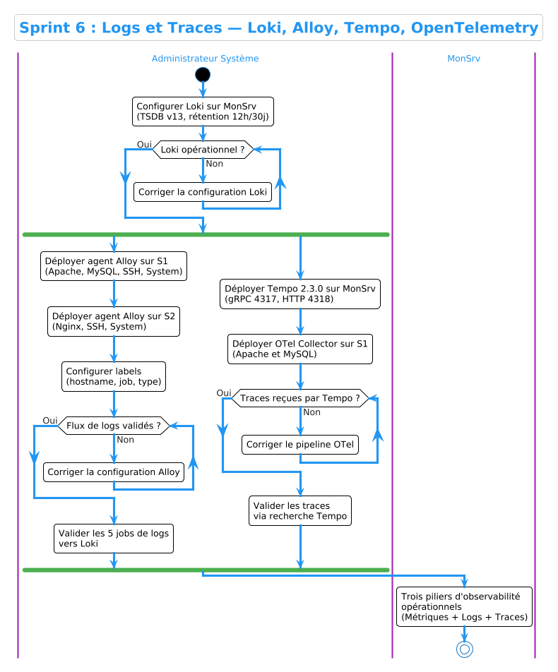
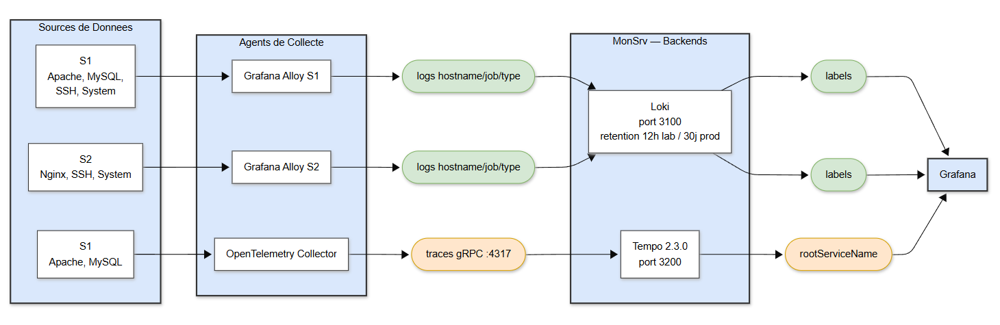

# Sprint 6 — Logs et Traces : Loki, Tempo, Alloy, OpenTelemetry

## Objectif

Mettre en place la collecte centralisée des **journaux (logs)** et des **traces distribuées** pour les serveurs S1 et S2. Ce sprint complète la stack d'observabilité en ajoutant les deux piliers manquants : **logs** via Grafana Loki + Grafana Alloy, et **traces** via Grafana Tempo + OpenTelemetry Collector.

---

## Architecture d'observabilité complète

```
                    ┌─────────────────────────────────┐
                    │           MonSrv                │
                    │  Prometheus  Loki  Tempo  Grafana│
                    └────────────────┬────────────────┘
                                     │
              ┌──────────────────────┼──────────────────────┐
              │                                             │
    ┌─────────▼──────────┐                      ┌──────────▼──────────┐
    │        S1          │                      │        S2           │
    │  Alloy (logs)      │                      │  Alloy (logs)       │
    │  Node Exporter     │                      │  Node Exporter      │
    │  OTel Collector    │                      │  Redis Exporter     │
    │  Apache + MySQL    │                      │  Nginx              │
    │  Trace Generators  │                      │                     │
    └────────────────────┘                      └─────────────────────┘
```

Les trois piliers de l'observabilité sont désormais couverts :

| Pilier | Outil | Source |
|--------|-------|--------|
| Métriques | Prometheus + Node Exporter | S1, S2, pve1 |
| Logs | Loki + Grafana Alloy | S1, S2 |
| Traces | Tempo + OpenTelemetry | S1 |

---

## 1. Grafana Loki — Collecte des logs

### Présentation

**Grafana Loki** est un système d'agrégation de logs conçu pour être économique en ressources. Contrairement à Elasticsearch, Loki n'indexe pas le contenu des logs mais uniquement leurs **labels** (métadonnées), ce qui réduit considérablement la consommation mémoire et disque.

Loki stocke les logs en blocs compressés sur le système de fichiers local (`/loki/chunks`). Ce stockage est monté comme volume Docker persistant sur MonSrv, garantissant que les logs survivent aux redémarrages des conteneurs.

### Configuration

La configuration complète de Loki est disponible dans le dépôt :

- **Fichier** : [`configs/loki/loki-config.yaml`](../../configs/loki/loki-config.yaml)

Points clés de la configuration :

- **Stockage filesystem** : les chunks sont écrits dans `/loki/chunks` sur le volume Docker persistant
- **Schema v13 (TSDB)** : format d'index moderne optimisé pour les requêtes
- **`creation_grace_period: 3h`** : tolère un léger décalage horaire entre les agents Alloy et le serveur Loki, évitant le rejet des logs dont le timestamp est légèrement en avance
- **`allow_structured_metadata: false`** : désactivé pour économiser les ressources dans l'environnement de lab

### Rétention des logs — Choix de configuration

Dans ce lab, la rétention des logs est gérée par la durée de vie des blocs Loki. Deux paramètres clés sont configurés selon le contexte :

**En environnement de lab :** les logs sont conservés **12 heures**. Ce choix est délibéré — le lab génère un volume de logs continu (Apache, MySQL, Nginx, SSH, système) qui s'accumule rapidement. Une rétention courte évite de saturer le disque de MonSrv qui dispose d'un espace limité dans l'environnement virtualisé.

**En production chez ACCENT :** la rétention serait configurée à **7 jours minimum**, voire 30 jours pour les logs de sécurité (SSH, système). Loki supporte nativement cette configuration via son compacteur :

```yaml
limits_config:
  retention_period: 720h   # 30 jours

compactor:
  working_directory: /loki/compactor
  retention_enabled: true
  retention_delete_delay: 2h
  delete_request_store: filesystem
```

Avec un stockage objet (S3, MinIO), Loki peut conserver des mois ou des années de logs sans contrainte de disque local — c'est l'architecture recommandée pour ACCENT.

---

## 2. Grafana Tempo — Collecte des traces

### Présentation

**Grafana Tempo** est un backend de traces distribué compatible avec les protocoles **OpenTelemetry**, Jaeger et Zipkin. Il stocke les traces sous forme de blocs compressés sur le système de fichiers local ou dans un stockage objet.

### Configuration

La configuration complète de Tempo est disponible dans le dépôt :

- **Fichier** : [`configs/tempo/tempo.yaml`](../../configs/tempo/tempo.yaml)

Tempo écoute sur deux protocoles OTLP :

- **gRPC** sur le port **4317** — utilisé par l'OTel Collector de S1
- **HTTP** sur le port **4318** — alternative HTTP/protobuf

> **Rétention :** La rétention des traces est fixée à **12 heures** dans ce lab pour les mêmes raisons que Loki — économie d'espace disque. En production, une rétention de **7 jours** minimum serait appliquée, avec un stockage objet pour les traces long terme.

> **Note technique :** La version `grafana/tempo:2.3.0` est utilisée à la place de `latest`. Les versions récentes de Tempo requièrent une architecture AMD64 v2 (AVX2), incompatible avec l'environnement de virtualisation imbriquée (EVE-NG → Proxmox → VM). La version 2.3.0 est la dernière compatible avec ce contexte.

---

## 3. Grafana Alloy — Agent de collecte des logs

### Présentation

**Grafana Alloy** est l'agent de collecte de logs et de métriques de nouvelle génération de Grafana Labs. Il remplace Promtail et Grafana Agent avec une configuration unifiée en langage **River** (`.alloy`).

Alloy est déployé sur **S1 et S2** pour collecter :

- Les journaux **systemd** (SSH, système)
- Les fichiers de logs des services (Apache, MySQL sur S1 ; Nginx sur S2)

### Configuration

Les configurations complètes d'Alloy sont disponibles dans le dépôt :

- **S1** : [`configs/alloy/s1-config.alloy`](../../configs/alloy/s1-config.alloy)
- **S2** : [`configs/alloy/s2-config.alloy`](../../configs/alloy/s2-config.alloy)

Chaque configuration définit :

- Un composant `loki.write "default"` pointant vers Loki sur MonSrv (`http://192.168.50.10:3100/loki/api/v1/push`)
- Des sources `loki.source.journal` pour les logs systemd (SSH, système) avec `max_age = "168h"` pour la résilience
- Des sources `loki.source.file` pour les logs applicatifs (Apache/MySQL sur S1, Nginx sur S2)

### Labels utilisés

Chaque stream de logs dans Loki est identifié par ses labels :

| Label | Valeurs possibles | Description |
|-------|-------------------|-------------|
| `job` | apache, mysql, nginx, ssh, system | Type de service |
| `hostname` | server1, server2 | Serveur source |
| `type` | access, error, general | Type de log |

---

## 4. Persistance des logs — Conception de la résilience

### Persistance sur MonSrv

Les données Loki sont stockées dans un répertoire local monté comme volume Docker :

```yaml
loki:
  volumes:
    - ./loki-data:/loki
```

Ce répertoire survit aux redémarrages du conteneur Loki et aux redémarrages de MonSrv. Les logs ingérés restent disponibles dans Grafana même après un arrêt complet du lab.

Les permissions sont définies explicitement via le script [`scripts/setup-volumes.sh`](../../scripts/setup-volumes.sh) pour garantir l'écriture sans droits root :

```bash
chown -R 10001:10001 ~/monitoring-stack/loki-data
```

### Résilience côté agents — Le rôle du paramètre `max_age`

Le paramètre `max_age = "168h"` configuré sur les sources journal d'Alloy est le mécanisme clé de résilience. Il définit jusqu'où dans le passé Alloy doit relire les journaux systemd au démarrage.

**Scénario typique sans `max_age` :** Si S1 s'arrête pendant 6 heures (maintenance, panne), au redémarrage Alloy ne renvoie que les nouvelles entrées. Les 6 heures de logs SSH et système pendant la panne sont perdues dans Loki.

**Avec `max_age = "168h"` :** Au redémarrage d'Alloy, le système relit les journaux systemd des 7 derniers jours et renvoie tout ce qui n'a pas encore été ingéré par Loki. La continuité des logs est garantie même après une interruption prolongée d'un serveur.

Ce mécanisme couvre également le cas où **MonSrv lui-même redémarre** : Alloy continue de stocker les logs localement dans son buffer et les renvoie dès que Loki est de nouveau disponible.

### Positions files — Suivi de lecture des fichiers

Pour les sources fichiers (Apache, MySQL, Nginx), Alloy maintient des **fichiers de positions** (`positions.yml`) qui enregistrent la dernière position de lecture dans chaque fichier log. Ces fichiers sont stockés dans un volume persistant :

```yaml
alloy:
  volumes:
    - alloy_data:/data-alloy
```

Grâce à ces positions files, Alloy reprend exactement là où il s'était arrêté après un redémarrage — aucun log n'est envoyé deux fois, et aucun n'est manqué.

---

## 5. OpenTelemetry Collector — Collecte des traces sur S1

### Présentation

L'**OpenTelemetry Collector** est déployé sur S1 pour recevoir les traces générées par les services applicatifs et les transmettre à Tempo sur MonSrv.

### Configuration

La configuration complète de l'OTel Collector est disponible dans le dépôt :

- **Fichier** : [`configs/otel/otel-collector.yml`](../../configs/otel/otel-collector.yml)

Points clés de la configuration :

- **Récepteurs OTLP** : gRPC (4317) et HTTP (4318) pour recevoir les traces des générateurs
- **Processeur batch** : regroupe les spans avant envoi pour optimiser les performances
- **Deux pipelines distincts** :
  - `traces` → Tempo via gRPC (port 4317)
  - `logs` → Loki via HTTP (port 3100)

---

## 6. Générateurs de traces

Pour simuler une activité applicative réaliste et démontrer les capacités de tracing, deux **générateurs de traces** sont déployés sur S1 :

### Apache Trace Generator

Ce générateur surveille les logs d'accès Apache en temps réel et crée une trace OpenTelemetry pour chaque requête HTTP détectée. La trace inclut :

- La méthode HTTP (GET, POST...)
- L'URL demandée
- Le code de réponse HTTP
- La durée de traitement

### MySQL Trace Generator

Ce générateur intercepte les requêtes MySQL dans le general log et crée des traces pour chaque opération de base de données, permettant de visualiser les requêtes SQL dans Grafana Tempo.

Les traces sont envoyées au format **OTLP gRPC** vers l'OTel Collector local, qui les relaie ensuite à Tempo.

---

## 7. Stack Docker Compose sur S1

La stack complète déployée sur S1 est définie dans le fichier :

- **Fichier** : [`configs/docker-compose/s1-agents/docker-compose.yml`](../../configs/docker-compose/s1-agents/docker-compose.yml)

Services déployés :

| Service | Rôle |
|---------|------|
| `alloy` | Collecte des logs (systemd + fichiers) vers Loki |
| `node-exporter` | Exposition des métriques système (port 9100) |
| `apache` | Serveur web HTTP (port 8080) |
| `mysql` | Base de données MySQL (port 3306) |
| `otel-collector` | Collecte et relais des traces vers Tempo |
| `apache-trace-generator` | Génération de traces à partir des logs Apache |
| `mysql-trace-generator` | Génération de traces à partir des logs MySQL |

La stack sur S2 est similaire (sans les générateurs de traces) :

- **Fichier** : [`configs/docker-compose/s2-agents/docker-compose.yml`](../../configs/docker-compose/s2-agents/docker-compose.yml)

---

## 8. Vérification de la collecte

### Vérification des labels Loki

```bash
curl -s "http://192.168.50.10:3100/loki/api/v1/labels" | python3 -m json.tool
```

Résultat attendu :

```json
{
  "status": "success",
  "data": ["filename", "hostname", "job", "service_name", "type"]
}
```

### Vérification des jobs actifs

```bash
curl -s "http://192.168.50.10:3100/loki/api/v1/label/job/values" | python3 -m json.tool
```

Résultat attendu :

```json
{
  "status": "success",
  "data": ["apache", "mysql", "nginx", "ssh", "system"]
}
```

### Vérification des traces dans Tempo

```bash
curl -s "http://192.168.50.10:3200/api/search?limit=5" | python3 -m json.tool | grep "rootServiceName"
```

Résultat attendu :

```
"rootServiceName": "apache"
"rootServiceName": "mysql"
```

---

## Résultat

À l'issue de ce sprint, la collecte des logs et des traces est opérationnelle :

| Source | Logs collectés | Statut |
|--------|----------------|--------|
| S1 | Apache access/error, MySQL, SSH, System | ✅ |
| S2 | Nginx access/error, SSH, System | ✅ |
| S1 | Traces Apache (HTTP requests) | ✅ |
| S1 | Traces MySQL (SQL queries) | ✅ |

La stack d'observabilité complète (**métriques + logs + traces**) est fonctionnelle et accessible via Grafana sur MonSrv.

---

## Diagrammes

### Diagramme d'Activité



### Diagramme de Composants



---

## Captures d'Écran

### 1. Loki — Labels disponibles

```bash
curl -s "http://192.168.50.10:3100/loki/api/v1/labels" | python3 -m json.tool
```

**Montrer :** Les labels hostname, job, service_name, type confirmant la réception des logs

### 2. Loki — Jobs actifs

```bash
curl -s "http://192.168.50.10:3100/loki/api/v1/label/job/values" | python3 -m json.tool
```

**Montrer :** apache, mysql, nginx, ssh, system tous présents

### 3. Grafana Explore — Logs Apache S1

Grafana → Explore → Loki → `{job="apache", hostname="server1"}`  
**Montrer :** Logs Apache avec timestamps, lignes de requêtes HTTP visibles

### 4. Grafana Explore — Logs SSH S2

Grafana → Explore → Loki → `{job="ssh", hostname="server2"}`  
**Montrer :** Logs SSH avec connexions acceptées visibles

### 5. Grafana — Dashboard Logs S1

`http://192.168.50.12/grafana/` → **Logs S1**  
**Montrer :** Panneaux Apache access, SSH logins, system logs avec données

### 6. Grafana — Dashboard Logs S2

`http://192.168.50.12/grafana/` → **Logs S2**  
**Montrer :** Panneaux Nginx access, SSH, system logs avec données

### 7. Tempo — Traces disponibles

```bash
curl -s "http://192.168.50.10:3200/api/search?limit=5" | python3 -m json.tool
```

**Montrer :** Traces Apache et MySQL avec traceID, rootServiceName, timestamps

### 8. Grafana — Dashboard Traces

`http://192.168.50.12/grafana/` → **Traces Dashboard**  
**Montrer :** Panneaux Apache Traces et MySQL Traces avec données visibles

### 9. Grafana Explore — Trace détaillée

Grafana → Explore → Tempo → cliquer sur un traceID Apache  
**Montrer :** Vue détaillée d'une trace avec spans, durée, attributs HTTP

### 10. Alloy — Logs de démarrage S1

```bash
docker logs alloy 2>&1 | grep "start tailing" | head -10
```

**Montrer :** Alloy démarrant et commençant à surveiller les fichiers Apache, MySQL

### 11. Volumes persistants MonSrv

```bash
ls -lh ~/monitoring-stack/loki-data/chunks/
```

**Montrer :** Blocs de logs Loki stockés sur disque confirmant la persistance
```


| 📝 Captures d'écran restructurées | Liste détaillée avec commandes pour reproduire |

Tu peux maintenant copier-coller ce contenu dans `docs/sprints/sprint-6.md`. Dis-moi "done" et on passe au Sprint 7 !
