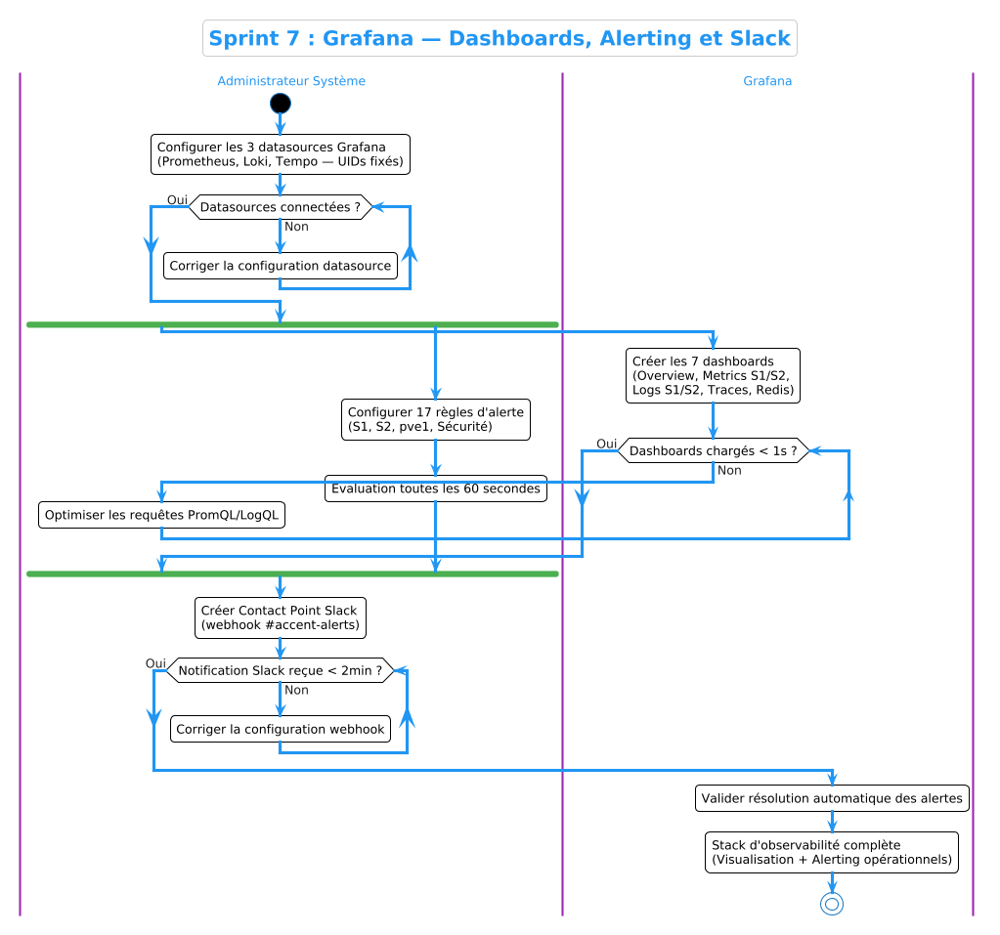
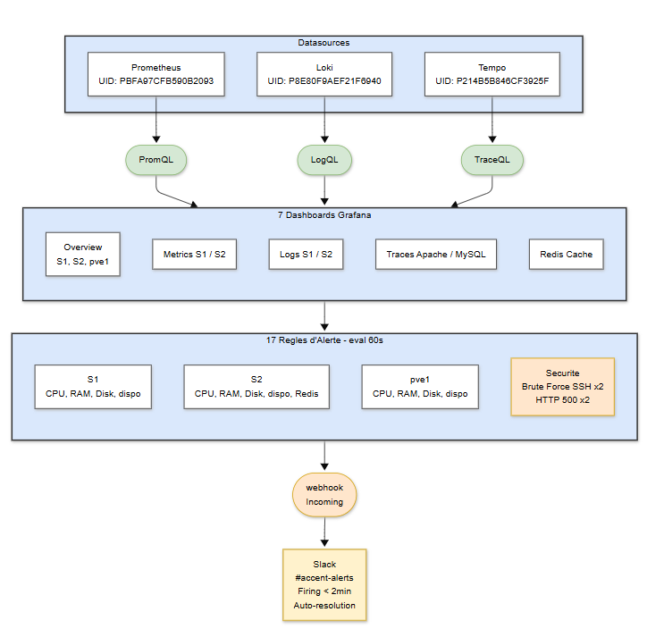

# Sprint 7 — Grafana : Dashboards & Alerting

## Objectif

Déployer les dashboards de visualisation Grafana pour l'ensemble de l'infrastructure ACCENT et configurer un système d'alerting professionnel avec notifications Slack en temps réel. Ce sprint constitue la couche de visualisation et d'alerte de la stack d'observabilité complète.

---

## Architecture des dashboards

```
┌─────────────────────────────────────────────────────┐
│                    Grafana                          │
│                                                     │
│  Overview         Logs S1        Logs S2            │
│  S1 + S2 + pve1   Apache         Nginx              │
│  CPU/RAM/Disk/Net MySQL          SSH                │
│                   SSH                               │
│  Traces           Redis          Alerting           │
│  Apache + MySQL   Cache          17 règles          │
│  OTel traces      Métriques      → Slack            │
└─────────────────────────────────────────────────────┘
```

---

## 1. Déploiement des dashboards

### Format et provisionnement

Chaque dashboard Grafana est défini sous forme de fichier **JSON** et provisionné automatiquement au démarrage de Grafana via le dossier de provisioning. Ce format permet une gestion en infrastructure-as-code — les dashboards sont versionnables, reproductibles et déployables sur n'importe quelle instance Grafana sans configuration manuelle.

Les fichiers de configuration sont disponibles dans le dépôt :

- **Dashboards JSON** : [`configs/grafana/dashboards/`](../../configs/grafana/dashboards/)
- **Provisioning dashboards** : [`configs/grafana/provisioning/dashboards/dashboard.yml`](../../configs/grafana/provisioning/dashboards/dashboard.yml)
- **Provisioning datasources** : [`configs/grafana/provisioning/datasources/datasources.yml`](../../configs/grafana/provisioning/datasources/datasources.yml)

Chaque fichier JSON définit l'ensemble des panneaux, leurs requêtes (PromQL ou LogQL), leur disposition sur la grille, les datasources utilisées et les seuils d'alerte visuels. Les UIDs des datasources sont fixés (`PBFA97CFB590B2093` pour Prometheus, `P8E80F9AEF21F6940` pour Loki, `P214B5B846CF3925F` pour Tempo) pour garantir la portabilité entre instances.

---

## 2. Dashboard Overview — Infrastructure ACCENT

Le dashboard Overview offre une vue consolidée de l'état de santé de l'ensemble de l'infrastructure en un seul écran. L'objectif est de permettre à un opérateur de diagnostiquer en un coup d'œil l'état de tous les serveurs sans naviguer entre plusieurs vues.

### Structure

Trois sections compactes côte à côte — une par serveur — chacune affichant 6 indicateurs clés en stat panels colorés (vert/jaune/rouge selon seuils) :

| Indicateur | S1 | S2 | pve1 |
|------------|----|----|------|
| Uptime | ✅ | ✅ | ✅ |
| CPU % | ✅ | ✅ | ✅ |
| RAM % | ✅ | ✅ | ✅ |
| Disk % | ✅ | ✅ | ✅ |
| Network | ✅ | ✅ | ✅ |
| Load Avg | ✅ | ✅ | ✅ |

Suivi de graphiques timeseries de comparaison CPU/RAM et réseau sur les 3 serveurs simultanément, permettant d'identifier les corrélations de charge entre serveurs.


---

## 3. Dashboards Métriques Système — S1 et S2

Des dashboards dédiés offrent une vue détaillée des métriques système pour chaque serveur, avec des graphiques timeseries pour analyser les tendances sur la durée.

### Métriques collectées via Node Exporter

Les métriques sont exposées par **Node Exporter** sur le port 9100 de chaque serveur et collectées par Prometheus toutes les 15 secondes. Les principales requêtes PromQL utilisées :

```promql
# CPU Usage
100 - (avg(rate(node_cpu_seconds_total{job="s1-node",mode="idle"}[5m])) * 100)

# RAM Usage
(1 - (node_memory_MemAvailable_bytes{job="s1-node"} / node_memory_MemTotal_bytes{job="s1-node"})) * 100

# Disk Usage
100 - ((node_filesystem_avail_bytes{job="s1-node",mountpoint="/"} / node_filesystem_size_bytes{job="s1-node",mountpoint="/"}) * 100)

# Network Traffic
rate(node_network_receive_bytes_total{job="s1-node",device="ens3"}[5m])
```

### System Metrics S1


### System Metrics S2


---

## 4. Dashboard Logs S1 — Serveur Applicatif

Le dashboard Logs S1 va au-delà de la simple affichage de logs bruts — il **extrait des métriques à partir des logs** via des requêtes LogQL sur Loki. Cette approche permet de quantifier l'activité applicative sans modifier le code des applications.

### Métriques extraites des logs

Les requêtes LogQL utilisent des filtres sur le contenu des logs pour créer des métriques en temps réel :

```logql
# Taux de requêtes Apache
sum(rate({job="apache", hostname="server1", type="access"}[5m]))

# Taux d'erreurs 404
sum(rate({job="apache", hostname="server1"} |= "404" [5m]))

# Taux de requêtes MySQL SELECT
sum(rate({job="mysql", hostname="server1"} |~ "(?i)select" [5m]))

# Tentatives brute force SSH
sum(rate({job="ssh", hostname="server1"} |= "Failed password" [5m]))
```

### Sections du dashboard

**Apache — Métriques HTTP :** 6 stat panels (Request Rate, 200 OK/s, 404/s, 500/s, 301/s, Errors/s) + timeseries de distribution des codes HTTP + logs d'accès live.

**MySQL — Activité Base de Données :** Query Rate, SELECT/INSERT/UPDATE/DELETE par seconde, erreurs MySQL + timeseries des types de requêtes + MySQL query logs live.

**SSH — Sécurité :** Échecs/succès/invalides par seconde + timeseries des authentifications + SSH security events live (filtré sur Failed/Accepted/Invalid).


---

## 5. Dashboard Logs S2 — Serveur Web

Le dashboard Logs S2 applique la même approche d'extraction de métriques pour les services Nginx et SSH du serveur web.

### Sections

**Nginx — Métriques HTTP :** Request Rate, codes 200/404/500/301, Nginx Errors/s + timeseries de distribution + Nginx access logs live.

**SSH — Sécurité :** Identique à S1 mais pour server2.


---

## 6. Dashboard Traces — Apache & MySQL

Le dashboard Traces visualise les traces distribuées collectées via la chaîne OpenTelemetry → OTel Collector → Tempo.

### Fonctionnalités

Quatre stat panels affichent en temps réel le nombre de traces Apache/MySQL actives ainsi que les taux de requêtes sources (depuis les logs). Les tables interactives présentent les 25 dernières traces par service avec les colonnes TraceID, Start time, Service, Name et Duration (colorée selon seuils : vert < 100ms, jaune < 500ms, rouge > 500ms).

Chaque TraceID est un lien cliquable qui ouvre la vue détaillée Tempo avec le waterfall des spans, permettant d'analyser chaque opération individuelle.


### Exploration d'une trace détaillée


---

## 7. Dashboard Redis — Cache & Performance

Le dashboard Redis surveille l'instance Redis sur S2 via le Redis Exporter (port 9121).

### Métriques affichées

- Statut Redis UP/DOWN avec mapping visuel coloré
- Clients connectés en temps réel
- Mémoire utilisée vs maximum (timeseries)
- Commands/sec (timeseries)
- Cache Hit Rate — hits vs misses (indicateur de performance du cache)
- Total des clés en base


---

## 8. Sources de données Grafana

Trois datasources sont configurées dans Grafana, couvrant les trois piliers de l'observabilité :


| Datasource | Type | UID | Usage |
|------------|------|-----|-------|
| Prometheus | Prometheus | PBFA97CFB590B2093 | Métriques système (CPU, RAM, Disk, Network, Redis) |
| Loki | Loki | P8E80F9AEF21F6940 | Logs applicatifs (Apache, MySQL, Nginx, SSH, System) |
| Tempo | Tempo | P214B5B846CF3925F | Traces distribuées (Apache HTTP, MySQL SQL) |

La configuration de ces datasources est versionnée dans [`configs/grafana/provisioning/datasources/datasources.yml`](../../configs/grafana/provisioning/datasources/datasources.yml).

---

## 9. Système d'Alerting — 17 Règles

### Architecture d'alerting

```
Prometheus / Loki
       │  (métriques + logs)
       ▼
Grafana Alert Engine
       │  (évaluation toutes les 1min)
       ▼
Contact Point: Slack-ACCENT
       │  (webhook Incoming)
       ▼
Canal #accent-alerts (Slack)
```

Le moteur d'alerting Grafana évalue les règles toutes les **60 secondes**. Chaque règle définit une expression de condition, une période de stabilisation (`for`) avant déclenchement, et des labels de sévérité et de serveur pour le routage.

### Définition des règles en YAML

Les règles d'alerte sont définies dans un fichier YAML structuré en groupes, importé via l'API Grafana. Chaque règle spécifie :

```yaml
- alert: CPU_Eleve_S1
  expr: 100 - (avg(rate(node_cpu_seconds_total{job="s1-node",mode="idle"}[5m])) * 100) > 85
  for: 2m
  labels:
    severity: warning
    server: s1
  annotations:
    summary: CPU usage sur S1 dépasse 85%
    description: Le serveur applicatif S1 utilise plus de 85% du CPU depuis 2 minutes.
```

### Règles d'alerte configurées


Les 17 règles sont organisées en 4 groupes :

**Infrastructure — S1 (4 règles)**

| Règle | Condition | Sévérité |
|-------|-----------|----------|
| CPU Élevé S1 | CPU > 85% pendant 2min | Warning |
| RAM Élevée S1 | RAM > 85% pendant 2min | Warning |
| Disque Critique S1 | Disk > 90% pendant 5min | Critical |
| S1 Inaccessible | up{job="s1-node"} < 1 pendant 1min | Critical |

**Infrastructure — S2 (5 règles)**

| Règle | Condition | Sévérité |
|-------|-----------|----------|
| CPU Élevé S2 | CPU > 85% pendant 2min | Warning |
| RAM Élevée S2 | RAM > 85% pendant 2min | Warning |
| Disque Critique S2 | Disk > 90% pendant 5min | Critical |
| S2 Inaccessible | up{job="s2-node"} < 1 pendant 1min | Critical |
| Redis Hors Service | redis_up < 1 pendant 1min | Critical |

**Infrastructure — pve1 (4 règles)**

| Règle | Condition | Sévérité |
|-------|-----------|----------|
| CPU Élevé pve1 | CPU > 90% pendant 3min | Critical |
| RAM Critique pve1 | RAM > 90% pendant 3min | Critical |
| Disque Critique pve1 | Disk > 85% pendant 5min | Critical |
| pve1 Inaccessible | up{job="pve1-node"} < 1 pendant 1min | Critical |

**Sécurité — Détection Intrusion (4 règles)**

| Règle | Condition | Sévérité |
|-------|-----------|----------|
| Brute Force SSH S1 | > 30 échecs SSH/min sur server1 | Warning |
| Brute Force SSH S2 | > 30 échecs SSH/min sur server2 | Warning |
| Erreurs HTTP 500 Apache | > 6 erreurs 500/min sur Apache S1 | Warning |
| Erreurs HTTP 500 Nginx | > 6 erreurs 500/min sur Nginx S2 | Warning |

> **Note :** Les seuils de sévérité sont calibrés pour l'environnement de lab. En production chez ACCENT, les seuils CPU/RAM seraient ajustés selon les SLAs définis (typiquement 80% avec alertes progressives warning/critical).

---

## 10. Contact Point Slack

Le contact point `Slack-ACCENT` est configuré comme destination par défaut pour toutes les alertes. Il utilise un webhook Incoming Slack vers le canal `#accent-alerts` de l'espace de travail ACCENT-Monitoring.


Ce même canal Slack reçoit également les alertes Wazuh (Sprint 8), centralisant toutes les notifications de sécurité et d'infrastructure dans un seul point de contact pour les équipes ACCENT.

> **Important :** Le webhook Slack est un secret et ne doit jamais être commité en clair. Il est remplacé par `<REDACTED>` dans les configurations du dépôt.

---

## 11. Test et validation des alertes

Pour valider le système d'alerting de bout en bout, une alerte "S1 Inaccessible" est déclenchée en simulant une interruption du Node Exporter de S1. Le test valide le cycle complet : détection → notification → résolution.

### Alerte déclenchée — État Firing


Grafana détecte que `up{job="s1-node"}` passe à 0 et passe l'alerte en état **Firing** après la période de stabilisation de 1 minute.

### Notification Slack reçue


La notification Slack est reçue en moins de 2 minutes avec les informations de l'alerte, le serveur concerné et la description de l'incident.

### Alerte résolue automatiquement


Lorsque le Node Exporter S1 redevient accessible, Grafana détecte automatiquement la résolution et envoie une notification de résolution sur Slack — sans intervention manuelle.

---

## Résultat

À l'issue de ce sprint, la stack de visualisation et d'alerting est opérationnelle :

| Dashboard | Datasource | Statut |
|-----------|-----------|--------|
| Overview — S1/S2/pve1 | Prometheus | ✅ |
| System Metrics S1 | Prometheus | ✅ |
| System Metrics S2 | Prometheus | ✅ |
| Logs S1 — Apache/MySQL/SSH | Loki | ✅ |
| Logs S2 — Nginx/SSH | Loki | ✅ |
| Traces — Apache & MySQL | Tempo | ✅ |
| Redis — Cache & Performance | Prometheus | ✅ |
| Alerting — 17 règles → Slack | Prometheus/Loki | ✅ |

---

## Diagrammes

### Diagramme d'Activité



### Diagramme de Composants



---

