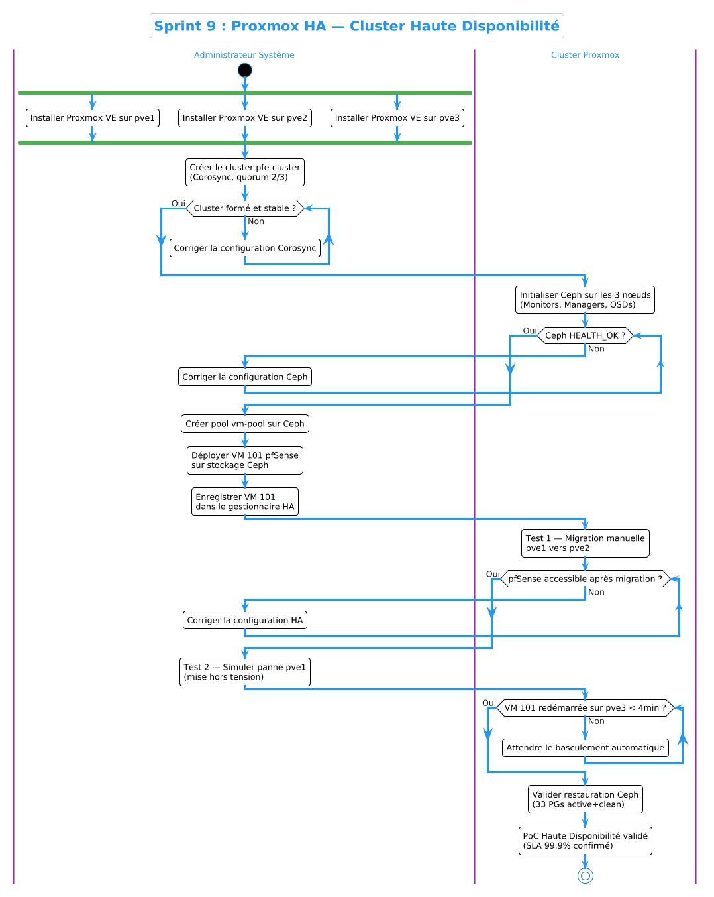
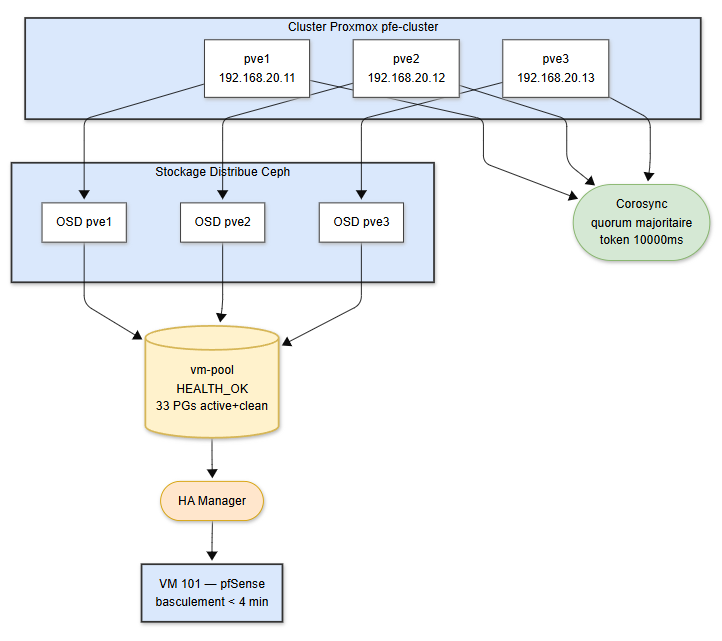

# Sprint 9 — Proxmox HA : Proof of Concept

## Objectif

Démontrer la haute disponibilité (HA) de l'infrastructure ACCENT via un cluster Proxmox 3 nœuds avec stockage Ceph partagé. Ce sprint constitue une **preuve de concept** : un seul service critique (pfSense) est déployé sur le cluster pour valider le mécanisme de basculement automatique sans interruption de service.

---

## Architecture du Cluster

```
┌──────────────────────────────────────────────────┐
│              Cluster pfe-cluster                 │
│                                                  │
│  ┌─────────┐   ┌─────────┐   ┌─────────┐        │
│  │  pve1   │   │  pve2   │   │  pve3   │        │
│  │.20.11   │   │.20.12   │   │.20.13   │        │
│  └────┬────┘   └────┬────┘   └────┬────┘        │
│       └─────────────┴─────────────┘             │
│                  Corosync                        │
│                  Ceph vm-pool                    │
│                                                  │
│           VM 101 — pfSense (HA)                  │
│           Disque sur Ceph shared                 │
└──────────────────────────────────────────────────┘
```

### Infrastructure matérielle (VMware)

Trois nœuds Proxmox identiques déployés sur VMware :

| Paramètre | Valeur |
|-----------|--------|
| RAM | 4096 MB |
| CPU | 1 socket, 2 cores |
| Disk 1 | 20 GB — OS Proxmox |
| Disk 2 | 20 GB — Ceph OSD |
| NIC 1 | VMnet9 — Management (192.168.20.0/27) |
| NIC 2 | VMnet10 — Corosync (192.168.30.0/29) |
| NIC 3 | VMnet11 — Ceph (192.168.40.0/29) |
| ISO | proxmox-ve_8.4-1.iso |

| Nœud | Hostname | IP Management | IP Corosync | IP Ceph |
|------|----------|---------------|-------------|---------|
| Node 1 | pve1.pfe.local | 192.168.20.11/27 | 192.168.30.1 | 192.168.40.1 |
| Node 2 | pve2.pfe.local | 192.168.20.12/27 | 192.168.30.2 | 192.168.40.2 |
| Node 3 | pve3.pfe.local | 192.168.20.13/27 | 192.168.30.3 | 192.168.40.3 |

---

## 1. Installation de Proxmox

Proxmox VE 8.4 est installé sur les trois nœuds depuis l'ISO officielle. Le nœud 2 et le nœud 3 sont clonés depuis le nœud 1 dans VMware, avec régénération des adresses MAC.


L'interface WebUI de chaque nœud est accessible sur :

- pve1 → `https://192.168.20.11:8006`
- pve2 → `https://192.168.20.12:8006`
- pve3 → `https://192.168.20.13:8006`

---

## 2. Création du Cluster Proxmox

### Synchronisation NTP (serveurs physiques)

Sur des serveurs physiques avec accès internet, synchroniser les horloges avant de créer le cluster — Corosync est sensible au décalage horaire entre nœuds :

```bash
apt install chrony -y
systemctl enable --now chrony
chronyc makestep
timedatectl status   # System clock synchronized: yes
```

### Création du cluster sur pve1

```bash
pvecm create pfe-cluster
```


### Ajout de pve2 et pve3

```bash
pvecm add 192.168.20.11
```


### Vérification du quorum

```bash
pvecm status
pvecm nodes
```


---

## 3. Configuration Corosync — Token Timeout

Le cluster tourne dans VMware en virtualisation imbriquée — chaque nœud Proxmox est une VM dont le vCPU peut être suspendu à tout moment par le scheduler VMware pour servir d'autres processus sur l'hôte Windows. Même avec un NIC dédié au Corosync (VMnet10, 192.168.30.0/29), ce délai d'ordonnancement VMware fait que le token Corosync n'est pas traité dans le délai imparti. Avec le timeout par défaut de 1000ms, un nœud parfaitement sain dont le vCPU a été pausé quelques centaines de millisecondes est déclaré mort — déclenchant des basculements inutiles.

Le timeout est augmenté à **10000ms** pour absorber ces délais de scheduling VMware sans déclencher de fausses alarmes. Sur des serveurs physiques, 1000ms est suffisant car il n'y a pas d'hyperviseur ajoutant de latence.

`/etc/pve/corosync.conf` est un fichier partagé par le cluster via pmxcfs — édition sur pve1 uniquement, synchronisation automatique sur pve2 et pve3 :

```bash
# Sur pve1 uniquement
nano /etc/pve/corosync.conf
# Ajouter dans la section totem : token: 10000
# Incrémenter config_version de 1

# Redémarrer corosync sur tous les nœuds
systemctl restart corosync
```

---

## 4. Déploiement de Ceph

Ceph fournit le stockage partagé distribué pour le cluster. Les disques des VMs sont répliqués sur les 3 nœuds, permettant le basculement HA sans déplacement de données.

### Initialisation

```bash
# Sur pve1 uniquement
pveceph init --network 192.168.40.0/29
```

### Monitors, Managers et OSDs

```bash
# Sur chaque nœud (pve1, pve2, pve3)
pveceph mon create
pveceph mgr create
pveceph osd create /dev/sdb
```

### Création du pool de stockage

```bash
# Sur pve1 uniquement
pveceph pool create vm-pool --add_storages
```

### Vérification

```bash
pveceph status
# Attendu :
# health: HEALTH_OK
# mon: 3 daemons, quorum pve1,pve2,pve3
# osd: 3 osds: 3 up, 3 in
```

---

## 5. Création de la VM pfSense (VM 101)

Dans le cadre de ce PoC, une seule VM est déployée sur le cluster : pfSense (VM 101). Son disque est stocké sur **vm-pool (Ceph)** — condition indispensable pour que le HA puisse migrer la VM d'un nœud à l'autre.

### Création via l'assistant Proxmox


### Spécifications de la VM

| Champ | Valeur |
|-------|--------|
| VM ID | 101 |
| Nom | pfsense |
| OS Type | Other |
| Stockage | vm-pool (Ceph) |
| Disque | 20 GB |
| CPU | 2 cores |
| RAM | 1024 MB |
| net0 | virtio, bridge=vmbr0 (LAN) |
| net1 | virtio, bridge=vmbr1 (WAN) |

> **Note :** Le disque doit impérativement être sur `vm-pool` (Ceph partagé) — le HA ne peut pas migrer les VMs sur stockage local.

### Installation de pfSense

pfSense CE 2.7.2 est installé depuis l'ISO. Après installation :

- LAN : `192.168.20.23/27`
- WebGUI : `http://192.168.20.23`


### Interface WebGUI pfSense


---

## 6. Configuration du HA

### Enregistrement de la VM dans le gestionnaire HA

```bash
ha-manager add vm:101 --state started
ha-manager set vm:101 --max_restart 2 --max_relocate 2
```

### Vérification

```bash
ha-manager status
# service vm:101 (pve1, started)
```


---

## 7. Test de Basculement HA

### État initial — vm:101 sur pve1

Avant toute migration, pfSense tourne sur pve1. Le cluster est complet, Ceph est opérationnel :


pfSense accessible sur `http://192.168.20.23` :


---

### Test 1 — Migration manuelle pve1 → pve2

```bash
ha-manager migrate vm:101 pve2
```

**Phase migrate** — vm:101 en cours de migration :


**Phase starting** — vm:101 démarre sur pve2 :


**Phase started** — vm:101 opérationnelle sur pve2 :


Proxmox WebUI — vm:101 listée sous pve2 :


pfSense reste accessible pendant et après la migration — le basculement est transparent :


### Retour sur pve1

```bash
ha-manager migrate vm:101 pve1
```

Phase migrate retour :


vm:101 de retour sur pve1 :


---

### Test 2 — Basculement automatique (simulation panne nœud)

**État avant coupure** — vm:101 sur pve1, cluster complet :


**pve1 mis hors tension dans VMware :**


**Détection de la panne** — pve1 détecté comme mort :


**Basculement** — vm:101 redémarrée sur pve3 :


Séquence observée :

| Temps | Événement |
|-------|-----------|
| T+0 | pve1 mis hors tension |
| T+10s | `lrm pve1 (old timestamp - dead?)` |
| T+~4min | `service vm:101 (pve3, started)` — VM migrée ✅ |

**pfSense accessible après basculement** — continuité de service confirmée :


**pve1 redémarré** — cluster restauré, tous les nœuds actifs :


**Ceph après restauration** — 3 OSDs up, 33 PGs active+clean :


---

## 8. Compréhension du Mécanisme de Fencing

Le **fencing** est le mécanisme par lequel le cluster isole de force un nœud défaillant avant qu'un autre nœud prenne le relais. Il protège contre le **split-brain** — situation où deux nœuds pensent tous deux être le maître et exécutent la même VM simultanément, causant une corruption des données Ceph.

Sans fencing : risque de double exécution de la VM → corruption du disque Ceph. Avec fencing : garantie qu'un seul nœud exécute la VM à tout moment.

---

## 9. Tolérance aux Pannes

Un cluster à 3 nœuds tolère exactement **1 panne simultanée** :

| Nœuds en panne | Proxmox HA | Ceph |
|----------------|------------|------|
| 0 | ✅ Normal | ✅ HEALTH_OK |
| 1 | ✅ Basculement automatique | ✅ Dégradé mais fonctionnel |
| 2 | ❌ Perte de quorum | ❌ Perte de quorum |

Cette contrainte est inhérente à l'algorithme de quorum (2/3 minimum) — protège contre le split-brain dans tous les scénarios à 1 panne.

---

## 10. Procédures Opérationnelles

Les procédures complètes de démarrage, arrêt et dépannage du cluster HA sont documentées dans le dépôt :

- **Fichier** : [`docs/operations/startup-shutdown-ha-cluster.md`](../../docs/operations/startup-shutdown-ha-cluster.md)

Ce document couvre :

- Ordre de démarrage et d'arrêt des nœuds
- Vérifications Ceph et Corosync
- Démonstration du basculement HA
- Dépannage des OSDs down et des alertes pg_num

---

## Résultat

À l'issue de ce sprint, la preuve de concept HA est validée :

- **Cluster Proxmox 3 nœuds** — pve1, pve2, pve3 — opérationnel avec Corosync et Ceph
- **Stockage partagé Ceph** — vm-pool avec 3 OSDs, réplication sur 3 nœuds
- **Migration manuelle validée** — basculement transparent pve1 ↔ pve2 sans interruption de service
- **Basculement automatique validé** — pfSense migré automatiquement vers pve3 en ~4 minutes après panne de pve1
- **Continuité de service confirmée** — pfSense reste accessible pendant et après le basculement
- **Token Corosync adapté** — timeout à 10000ms pour environnement VMware imbriqué

---

## Diagrammes

### Diagramme d'Activité



### Diagramme de Déploiement



---

## Captures d'Écran de Validation

### Installation Proxmox VE 8.4


### Création du Cluster


### Création de la VM pfSense


### Configuration HA


### Test de Migration Manuelle


### Test de Basculement Automatique


